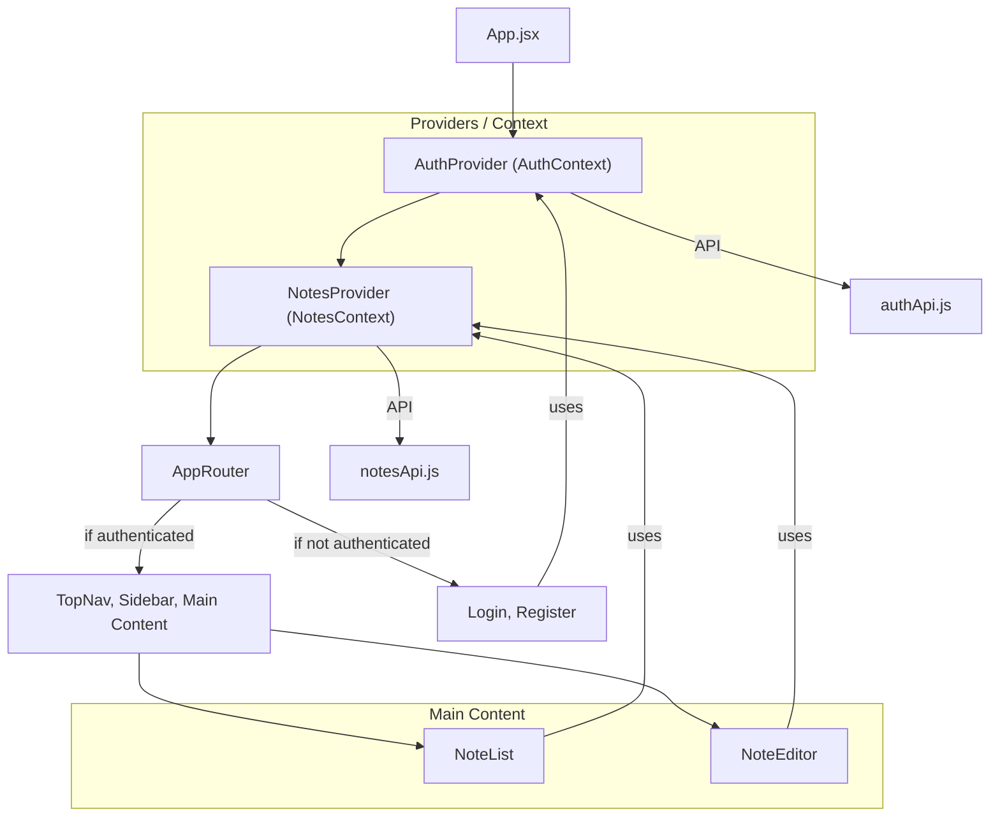

# Notes Frontend – Project Documentation

## Overview

The Notes Frontend is a lightweight, modern React web application designed for personal note management. It provides a simple, intuitive user interface allowing users to register, log in, and manage (create, edit, delete) notes. The app emphasizes ease-of-use, responsiveness, and clean design, relying on pure React and vanilla CSS (no external UI frameworks).

## Main Features

- **User Authentication:** Users can register and log in to their personal account. Authentication state is handled globally and persists in localStorage.
- **Create Notes:** Users can compose new notes, giving them a title and content.
- **Edit Notes:** Existing notes can be edited at any time.
- **Delete Notes:** Users can remove notes from their list.
- **List Notes:** All notes are listed for the authenticated user, sorted with clear, responsive design.
- **Navigation:** Sidebar and top navigation offer quick access to all major features.

## Application Architecture

### High-Level Structure

The application's structure is centered around two main context providers:
- **AuthContext:** Provides authentication state (user, login, logout, register) to the app.
- **NotesContext:** Supplies notes data (fetch, create, update, delete) and manages reactive state for notes.

All application routes are protected: unauthenticated users are redirected to login/register screens, and authenticated users access the main app shell (top navigation, sidebar, main content).

**Routing Flow:**
- /login, /register: Accessible only when logged out.
- /, /notes/new, /notes/:noteId: Accessible only when authenticated.

**Layout:**
- **Top Navigation Bar:** Shows app name, user email, and logout button.
- **Sidebar:** Contains navigation links to notes list and note creation.
- **Main Content Area:** Displays the list of notes, note editor (for viewing/creating/editing), or appropriate forms (login/register).

### Component Hierarchy

```
App
└── Router
    └── AuthProvider
        └── NotesProvider
            └── AppRouter
                ├── TopNav
                ├── Sidebar
                └── Main Content (Routes)
                    ├── NoteList
                    ├── NoteEditor
                    ├── Login
                    └── Register
```

### Key Contexts and State Management

- **AuthContext (`src/context/AuthContext.js`):**
  - Stores current user and authentication functions.
  - Interfaces with `src/services/authApi.js` for API calls and session handling (localStorage).
- **NotesContext (`src/context/NotesContext.js`):**
  - Holds the current user’s notes and CRUD operation methods.
  - Relies on `src/services/notesApi.js` for interaction with the backend API.

### Main Components

- **TopNav:** App header showing logo, app name, user info, and logout button.
- **Sidebar:** Offers navigation to note listing and note creation.
- **NoteList:** Displays a list of saved notes. Handles the empty state and loading indicators.
- **NoteEditor:** Form for creating or editing a note, with save/delete/cancel actions.
- **Login & Register:** Forms for user authentication, handled entirely client-side with UI feedback for loading and errors.

### File Structure

```
notes_frontend/
│
├── README.md
├── package.json
├── eslint.config.mjs
├── src/
│   ├── App.js
│   ├── App.css
│   ├── App.test.js
│   ├── index.js
│   ├── index.css
│   ├── setupTests.js
│   ├── components/
│   │   ├── TopNav.js / TopNav.css
│   │   ├── Sidebar.js / Sidebar.css
│   │   ├── NoteList.js / NoteList.css
│   │   ├── NoteEditor.js / NoteEditor.css
│   │   ├── Login.js
│   │   ├── Register.js
│   │   └── AuthForm.css
│   ├── context/
│   │   ├── AuthContext.js
│   │   └── NotesContext.js
│   └── services/
│       ├── authApi.js
│       └── notesApi.js
└── kavia-docs/
    └── PROJECT_OVERVIEW.md
```

### Styling and Theme Usage

- **CSS Variables:** Global color and theme variables are defined in `App.css`. This allows for quick customization of the primary, secondary, and accent colors, as well as shadows, borders, and radii.
  - Main theme colors:  
    - `--primary`: #1976d2 (blue)  
    - `--secondary`: #424242 (dark grey)  
    - `--accent`: #ff4081 (pink)  
    - `--bg-main`: #f8f9fa (light background)
- **Component-Level Styles:** Each major component has an associated `.css` file within its module (`components/`), e.g., `NoteList.css`, `NoteEditor.css`, etc.
- **Responsive Design:** Key components (e.g., TopNav) include responsive styles for mobile viewports.
- **Utility Classes:** Button and form styling provided via global CSS classes (e.g., `.btn`, `.btn-primary`, `.input`).

### Feature Summary

1. **Authentication** – Users log in/register; session stored in `localStorage`.
2. **Notes Management** – Full CRUD operations for notes, made available via React Context and performed through the backend API.
3. **UI Structure** – Clear split between navigation, sidebar, and main content, using modern, accessible, and responsive CSS.
4. **Error and Loading States** – User feedback for API calls and errors (e.g., loading indicators, error messages in forms).

## Component & Service Relationships – Diagram



## Customization & Theming

All primary theme colors and UI radii can be easily modified by editing the CSS variables in `src/App.css`. This enables rapid adaptation of the application's appearance to match other branding or accessibility requirements. If your organization or user prefers a different palette, change variables like `--primary`, `--accent`, and `--bg-main`.

## Summary

This codebase delivers a highly maintainable, easy-to-extend notes application with modern styling, clean state management, and clear division of concerns. By maximizing the use of React Context and minimizing dependencies, the app achieves both simplicity and flexibility for real-world note-taking scenarios.

---
_Last updated: [Auto-generated by DocumentationAgent]_
